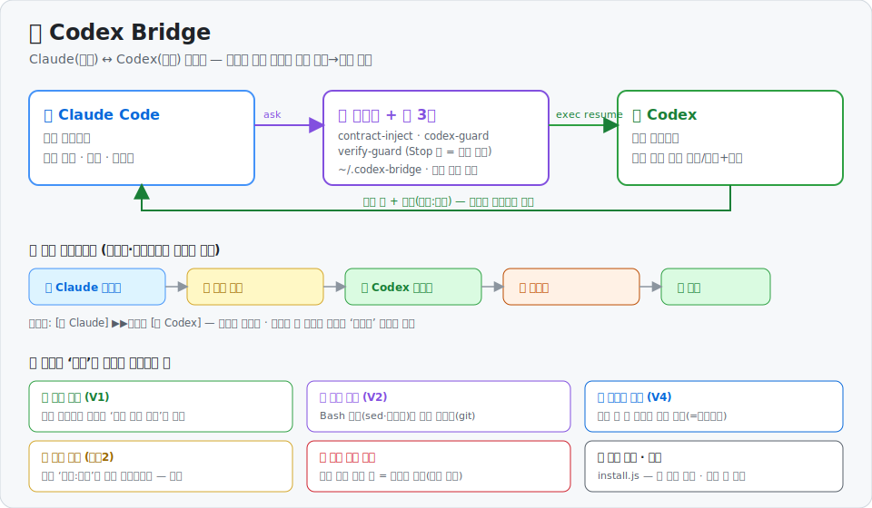

# Codex Bridge

Claude Code ↔ Codex(OpenAI) 를 **하나의 작업 흐름으로 잇는** 도구 모음입니다.
사람이 두 에이전트 사이에서 답을 복사·전달하지 않아도, **세션을 고정**하고 **고정 계약(규약)을 매 턴 주입**하며, 원하면 **구현→검증 2트랙**을 하니스가 강제합니다.

세 부분으로 구성됩니다.

| 구성 | 위치(런타임) | 역할 |
|---|---|---|
| **브릿지 엔진** | `~/.codex-bridge/codex-bridge.js` | Claude 세션 ↔ Codex 세션 연결을 영속 저장하고, 연결된 Codex 세션으로 `ask`(resume)·`link`·`status`·`find` |
| **훅(하니스 강제)** | `~/.codex-bridge/*.js` | `codex-guard`(raw codex 직접호출 차단) · `contract-inject`(계약 매 턴 주입) · `verify-guard`(검증 모드 시 종료 차단) |
| **VS Code 확장** | 이 저장소 루트 | 상태바·호버·대시보드로 연결 상태를 **보여주고**, 계약/체크박스를 **편집**하고, 연결을 **갈아끼움** |

확장만으로는 동작하지 않습니다. 엔진(`bridge/`)과 훅이 함께 있어야 합니다.

## 미리보기



> **Claude(구현) ⇄ 브릿지(훅) ⇄ Codex(검증)** — 사람이 답을 옮기지 않는 구현→검증 루프. 검증이 '흉내'가 아님을 보장하는 층(증명·변경 감지·재검증·근거 점검)과, 지금 검증이 어느 단계인지 **상태바·대시보드에 라이브 표시**합니다.

**상태바 — 검증 진행 라이브** (진행 중에만, 단계별 색):

```
[🧑 Claude]  ▶▶ 검증중 ▶▶  [🔍 Codex]      ← 코덱스에 묻는 중(코덱스 박스 초록)
[🧑 Claude]  ◀◀ 반영중 ◀◀  [🔍 Codex]      ← 검증 답 반영 중(클로드 박스 주황)
$(alert) Codex 검증 미완 1                   ← 검증 없이 끝난 턴 = 빨강 경보(확인 전까지 지속)
$(warning) Codex 근거 의심 2                  ← 검증 답이 인용한 '파일:라인'이 존재하지 않음 = 노랑
```

*(상태바 배경 채움색은 VS Code가 빨강/노랑만 허용 → 단계 구분은 글자색 + 화살표로, 빨강은 검증 미완 경보 전용.)*

<details><summary>📊 대시보드 레이아웃 (텍스트 도식)</summary>

```
🌉 Codex Bridge   Claude ⇄ Codex 자동 연결·검증                  [↻ 새로고침]

┌───────────────┐   ═══ 🔗 ═══   ┌───────────────┐
│    ( C )      │    연결됨      │    ( Cx )     │     ← 파랑/초록 모노그램
│    Claude     │  (초록 라인)   │     Codex     │
│ 구현·implement │               │  검증·verify   │
└───────────────┘               └───────────────┘
 🔁 코드 변경 시 검증   · (주제 스니펫)   <codex 세션 id>        ← 검증모드 색 배지

고정 계약 · 매 턴 자동 주입
 ▏Claude 지침      [textarea]   ☑ 체크리스트 강제      ← 파란 좌측바
 ▏Codex 규약       [textarea]   ☑ 체크리스트 강제      ← 초록 좌측바
 🔁 검증 모드 ⟨ 꺼짐 │ 코드 │ 플랜+코드 │ 모든 턴 ⟩ (세그먼트)   [저장]

🔒 기본 지침 (최소 동작 보장 고정 규약·커스텀 아님)   ▸ 펼치면 보기/수정/기본값복원

🔍 Codex 검증 대화
   [ 사용자 질문 ]                          → 오른쪽 파란 말풍선
   ┌ Codex · [검증: 통과] ───────────┐       → 왼쪽 카드(통과=초록/실패=빨강, 길면 "펼치기 ▾")
   │  … 근거 …                        │
   └──────────────────────────────────┘
🔗 다른 Codex 세션에 연결
```

실제 대시보드 스냅샷(이전 버전 UI — 무결성 배너·검증 진행 스트립은 위 도식 참조):


</details>

---

## 기능

### 1. 세션 고정 (링크)
- 연결은 `~/.codex-bridge/links.json` 에 **Claude 세션 id + 워크스페이스** 두 키로 영속 저장 → 재접속·압축·리로드에도 유지.
- `ask`: 연결된 Codex 세션으로 `resume`. **연결이 없으면 보고만** 하고 새 세션을 임의로 만들지 않음. 첫 소통만 `--allow-new` 로 명시 생성.
- raw `codex exec/resume` 직접 호출은 `codex-guard`(PreToolUse 훅)가 차단 → 모든 Codex 접근이 브릿지를 통과.

### 2. 고정 계약 (매 턴 주입)

대시보드에서 **Claude 지침**과 **Codex 규약**을 입력합니다. **규칙은 한 줄에 하나씩**(Enter로 구분) — 글자수와 무관하게 *줄 단위*로 끊으며, 각 줄이 개별 규칙(번호 1, 2, 3…)이 됩니다.

> **프로젝트별 분리**: 계약(규칙·검증 모드 포함)은 **워크스페이스마다 따로** 저장됩니다(`~/.codex-bridge/contracts/<키>.json`). 여러 VS Code 창을 동시에 띄워도 **창마다 자기 프로젝트의 계약·연결만** 보고/적용합니다(대시보드·상태바는 그 창의 폴더를 따라감). 아직 손대지 않은 프로젝트는 전역 기본값(`contract.json`)을 **상속**하고, 한 번 저장하면 그 프로젝트만의 파일로 갈라집니다.

- **Claude**: `contract-inject`(UserPromptSubmit 훅)가 매 턴 컨텍스트에 주입.
- **Codex**: 브릿지가 매 `ask` 프롬프트 앞에 prepend.
- 칸이 비면 주입하지 않습니다(토큰 비용 0).

**체크리스트 강제 체크박스**(Claude·Codex 각각)는 그 규칙들을 *어떻게* 주입할지 정합니다.

- **해제** — 규칙 텍스트만 상수로 주입:
  ```
  [고정 규약 · Claude Code · 매 턴 적용되는 상수]
  {"rules":[{"n":1,"r":"추측 말고 파일을 직접 읽어라"},{"n":2,"r":"완료 전 검증했는지 밝혀라"}]}
  ```
- **체크** — 같은 규칙들이 *점검 항목*으로 펼쳐지고, AI가 매 답변에 각 항목의 준수 여부+근거를 달도록 강제:
  ```
  [계약점검]
  - 1) <준수|위반|해당없음> — <한 줄 근거>
  - 2) <준수|위반|해당없음> — <한 줄 근거>
  ```

> 주입은 규칙을 매 턴 눈앞에 둬 "잊어버림"을 막지만, AI의 실제 준수를 100% 보장하진 않습니다(형식적 체크 가능). **강제 명시**이지 강제 이행은 아닙니다.

### 3. 검증 모드 (구현→검증 2트랙, opt-in · 기본 OFF)

대시보드 **세그먼트 토글**로 **국면별 4모드** 중 선택합니다. ON인 모드에서, 트리거가 걸린 턴은 `verify-guard`(Stop 훅)가 Claude의 종료를 막고, Claude가 `codex-bridge ask`로 Codex 검증을 받아 그 결과(통과/실패+근거)를 반영해 보고하도록 강제합니다(사람이 두 모델 사이를 중계하지 않음).

| 모드 | 검증을 강제하는 트리거 |
|---|---|
| **꺼짐(off)** | Codex 검증 왕복을 강제하지 않음(기본). ※*사용자 계약(Claude 행동규칙) 주입은 별개 축* — 계약이 설정돼 있으면 off여도 주입됨(주입 시점은 사용자 계약 카드의 꺼짐/플랜/항상 설정 따름). |
| **코드 변경 시(code)** | 파일 편집(`Write`/`Edit`/`MultiEdit`/`NotebookEdit`) **또는 git 저장소에서 Bash 경유 변경**(생성·수정·삭제) 발생 턴 |
| **플랜 확정 + 코드 변경 시(plancode)** | `ExitPlanMode`(플랜 확정) **또는** 위 파일 변경 발생 턴 |
| **모든 턴(always)** | 모든 응답 |

- **트리거는 결정적 신호로 판정** — transcript의 `tool_use`(`ExitPlanMode`·편집 툴) **+ (git 저장소면) 실제 파일 변경**(바뀐 파일의 수정시각). 즉 `sed -i`·생성기·`rm` 같은 **Bash 경유 변경도 잡습니다**(키워드 추측이 아니라 실제 변경 기준 → 우회 어려움). 별도 모델 추론이 없어 추가 토큰·오탐이 없습니다.
- 이 검증 흐름의 핵심 지시문(아래 세 가지)은 **기본 지침(base directive)** — 사용자 고정 계약과 **별개로 하네스 최소 동작을 보장하는 고정 규약**입니다. 대시보드의 접힌 **🔒 기본 지침** 섹션에서 **보기/수정/기본값 복원**할 수 있습니다(코드에 캐논 기본값 상존, 수정분은 `~/.codex-bridge/base-directive.json` 오버라이드; 비우면 기본값).
- **검증 기본 원칙(→Codex, 항상 적용)**: 모든 `ask` 앞에 붙습니다 — *코드·파일을 실제로 열어 확인 / 생략·요약·축약 금지 / **요청자가 준 파일·범위는 시작점일 뿐 한계가 아님 — 요청자의 결론을 전제로 삼지 말고 호출부·테스트·문서까지 독립적으로 넓혀 반례를 찾으라** / 첫 줄에 통과·실패 결론, 본문에 항목별 근거.* 엔진(`withContract`)이 강제하므로 Claude가 sloppy하게 요청해도 Codex 입력 단에서 방어됩니다.
- **전달 원칙(→Claude, 검증 요청 시)**: 요약/생략 없이 실제 파일 경로·확인 지점을 담되, **"여기만 봐라 / 이렇게 해라" 식 좁은 명령을 금지** — *내가 무엇을 했고·왜 했고·어떤 근거를 봤고·어디가 불안한지*를 주고 **내 결론은 "내 주장"으로 표시해 Codex가 공격하게** 합니다(파일·라인은 시작점, 검토 범위 확장은 Codex 판단에 맡김).
- **재판단(→Claude, 검증 답 받은 뒤)**: Codex 답을 그대로 옮기지 않고 **항목별로 수용/반박/보류 + 근거(파일·라인) + 사유**를 답니다. **수용 항목엔 반드시 근거**, 짧은 "동의/이견없음"으로 뭉개지 않습니다(반박·보류는 그 자체가 재판단 증거). 근거는 코드·파일에서 직접 확인 가능한 사실로. *(단, 지시 기반이라 100% 이행 보장은 아님 — 그래서 대시보드의 실제 검증 대화로 확인.)*
- **검증으로 인정되려면 Codex가 ‘실제로 성공 응답’해야 합니다** — 명령만 친 것·빈 응답·미연결·이전 턴 검증은 인정 안 됩니다. 브릿지가 성공 시 **증명(proof)**을 남기고 `verify-guard`가 그 증명(이번 사용자 발화 + 마지막 변경 이후 + 응답 존재)을 봅니다. *(`echo … codex-bridge ask` 같은 흉내로는 통과 못 함.)*
- **재검증 루프**: 검증을 못 받으면 한 턴에 **여러 번 재요청**하고, 무한정지 방지를 위해 상한(기본 3회) 후엔 통과시키되 **그 사실을 무결성 경보로 남깁니다**(아래 §4 빨강). **검증 후 또 고치면 다시 검증**을 강제 → ‘검증받은 상태 = 최종 상태’.
- 구버전 `contract.json`의 `verify: true`는 자동으로 `code` 모드로 해석됩니다(하위호환).

### 4. 시각화 (확장) — 검증이 ‘지금 무엇을 하는지’ + ‘진짜인지’를 눈에
- **상태바(연결)**: 연결된 Codex 세션 주제 / 미연결.
- **상태바(검증 진행 라이브)**: 검증이 도는 동안 `[🧑 Claude] ▶▶검증중 [🔍 Codex]`로 단계가 흐릅니다(작업중→검증 요청→Codex 생성중→반영중→완료, 단계별 글자색·라운드 카운터). 브릿지가 동기로 막혀 있어도 **코덱스 rollout 파일이 최근 갱신된 것을 보고 ‘Codex 생성중’을 라이브 추정**합니다.
- **상태바(무결성 경보)**: 검증이 필요했는데 **끝내 안 됐으면 빨강**(검증 미완, 확인 전까지 지속·신규 시 잠깐 점멸). 검증 답이 **인용한 `파일:라인`이 존재하지 않는 줄이면 노랑**(근거 의심 — 해석 불가·모호한 인용은 거짓경보 방지로 건너뜀). 우선순위 = 빨강 > 노랑 > 진행. *(상태바 배경 채움색은 VS Code가 빨강/노랑만 허용 — 그래서 진행 단계는 글자색으로, 빨강/노랑은 경보 전용.)*
- **호버**: 세션 id·주제·연결시각·마지막 활동.
- **대시보드**(클릭): 연결 상태(Claude⇄Codex 모노그램·연결 라인), **검증 진행 스트립**([Claude]⟷[Codex] 방향·활성 박스), **무결성 배너**(빨강=검증 미완 / 노랑=근거 의심, ‘확인함’으로 해제), **검증 대화**(사용자 말풍선 + Codex 카드·통과/실패 칩·긴 글 "펼치기"), 후보 세션 목록(첫 발화로 식별)+`[연결]`·숨김/복원, 고정 계약 편집칸+체크박스, **검증 모드 세그먼트 토글**, **두뇌 설정**(모델·생각 강도, 계정 캐시 기반), 접힌 **🔒 기본 지침** 보기/수정/기본값 복원. `links.json`·`~/.codex/sessions`·진행/무결성 변경 자동 감지.
- 대시보드·상태바는 **지금 Claude가 실제 도는 폴더**(훅이 `~/.codex-bridge/active.json`에 기록)를 따라가므로 **보여주는 세션 = 검증이 실제 가는 세션**이 일치합니다(열린 폴더가 여러 개여도 어긋나지 않음). 어느 폴더 기준인지는 📁 칩으로 표시됩니다.

### 5. Codex 실행 파일 탐색 + 진단(doctor)
브릿지는 codex 바이너리를 **경로로 뒤지지 않고** 다음 순서로 해석합니다(설치 형태·잦은 버전 업데이트에 안 깨짐):
1. 환경변수 `CODEX_BIN` (직접 지정)
2. VS Code 설정 `codexBridge.codexPath` — 비우면 **설치된 Codex 확장(`openai.chatgpt` 등) 내부의 codex를 확장이 vscode API로 자동 탐색**해 기록(포터블/설치형·버전 무관, 활성화마다 갱신)
3. `PATH` 의 `codex` (CLI 설치 표준; Windows `.cmd`는 셸 경유, 프롬프트는 stdin이라 따옴표 안전)

진단: `node ~/.codex-bridge/codex-bridge.js doctor` → 지금 **어떤 codex를 어디서 쓰는지·실행 가능 여부·연결 상태·브릿지 폴더 일치**를 한 번에 표시(막혔을 때 추측 대신 이것부터). (홈 경로에 공백이 있으면 경로를 따옴표로 — `node "$HOME/.codex-bridge/codex-bridge.js" doctor`. 아래 CLI 섹션 노트 참조.)

---

## 설치

### 한방 설치 (권장)
레포 루트에서 한 줄이면 됩니다. 브릿지 엔진 복사 + `~/.claude/settings.json` 훅 자동 병합(기존 훅 보존) + 백업 + 확장 설치(가능 시)까지 한 번에.

```bash
npm install
node install.js            # 또는: sh install.sh   /   Windows: install.cmd 더블클릭
```

- 여러 번 돌려도 안전(멱등). 옛 형태로 등록돼 있던 우리 훅은 새 형태로 업그레이드되고, **memento 등 다른 훅은 그대로 보존**됩니다.
- 설정을 고치기 전 항상 타임스탬프 백업(`settings.json.bak.<시각>`)을 남깁니다. 설정이 올바른 JSON이 아니면 **건드리지 않고 중단**합니다.
- 훅이 쓸 `node` 경로는 셸에서 실제 실행되는지 확인해 **절대경로로 고정**합니다(공백 있는 경로·`PATH`에 node 없는 환경 대응).
- 미리보기: `node install.js --dry-run` (아무것도 쓰지 않고 무엇을 바꿀지 보여줌).
- 제거: `node install.js uninstall` (우리 훅만 제거, 백업 보존) / 완전삭제 `node install.js uninstall --purge`.
- 낯선 환경 조정 환경변수: `CODEX_BRIDGE_HOME`(브릿지 폴더) · `CLAUDE_CONFIG_DIR`(Claude 설정 폴더) · `CODEX_BRIDGE_NODE`(훅용 node 절대경로) · `CODE_CLI`(VS Code `code` 경로).
- 설치 후 VS Code에서 `Developer: Reload Window`.

> 설치기는 외부 파일인 `~/.claude/settings.json` 을 바꿉니다. 무엇이 바뀌는지 먼저 보려면 `--dry-run` 을 권합니다.

아래는 수동으로 단계별로 설치하려는 경우의 절차입니다(한방 설치를 썼다면 건너뜁니다).

### 1) 브릿지 엔진·훅 배치 (수동)
`bridge/` 의 `.js` 파일들을 홈의 `~/.codex-bridge/` 로 복사합니다.

```bash
mkdir -p ~/.codex-bridge
cp bridge/*.js ~/.codex-bridge/
```

`contract.example.json` 을 참고해 `~/.codex-bridge/contract.json`(**전역 기본값**)을 만들거나, 대시보드에서 작성합니다. 대시보드에서 저장하면 **프로젝트별 파일**(`~/.codex-bridge/contracts/<키>.json`)로 갈라지고, 아직 설정 안 한 프로젝트는 이 전역 기본값을 상속합니다.

### 2) 훅 등록 (수동)
`settings.example.json` 의 `hooks` 블록을 Claude Code `~/.claude/settings.json` 에 병합합니다.
`<HOME>` 을 실제 홈 경로(예: `C:/Users/이름`)로 바꾸고, 기존 다른 훅은 보존하세요.

> **글로벌(`~/.claude/settings.json`)에 넣어도 안전합니다 — 프로젝트별로 반복 설정할 필요 없음.** 훅은 항상 등록돼 있되, 실제 동작·비용은 **전적으로 확장 대시보드(고정 계약 / 검증 모드)가 제어**하기 때문입니다:
> - `codex-guard` — 직접 `codex` 호출 가드. **모델 토큰 0**(통과/차단만).
> - `verify-guard` — 검증 모드가 **꺼짐이면 즉시 no-op**. 켰을 때만, 고른 트리거에서 동작.
> - `contract-inject` — **대시보드 계약 칸에 적은 줄만** 주입. 칸을 비우면 주입 0.
>
> 즉 기본/비활성 상태에서는 글로벌이어도 사실상 무비용이고, 무엇을 켤지는 `settings.json` 을 건드리지 않고 대시보드에서 토글합니다. (에이전트로 설치를 자동화할 때 "글로벌 훅이 매 턴 비용 아니냐"는 우려가 불필요한 이유)

### 3) 확장 설치 (수동)
```bash
npm install
npm run package
code --install-extension codex-bridge-*.vsix --force
```
설치 후 `Developer: Reload Window`.

> Codex 실행 파일은 OpenAI ChatGPT VS Code 확장(`openai.chatgpt-*`)의 `codex` 바이너리를 자동 탐색합니다. 필요 시 `CODEX_BIN` 환경변수로 지정하세요.

---

## CLI (브릿지 엔진 직접 사용 · 선택)

`~/.codex-bridge/codex-bridge.js` 는 Codex와 실제로 대화하는 **엔진**입니다. 평소엔 **확장·훅이 자동으로 호출**하므로 직접 칠 필요가 없고, 아래는 **수동 연결·상태 확인·문제 진단**용입니다.

> 💡 **홈 경로에 공백이 있으면**(예: `C:/Users/First Last`) 경로를 따옴표로 감싸세요 — `node "$HOME/.codex-bridge/codex-bridge.js" doctor`. `node`가 PATH에 없으면 node를 절대경로로(예: `"C:/Program Files/nodejs/node.exe"`). `CODEX_BRIDGE_HOME`을 설정하면 `.codex-bridge` 위치를 옮길 수 있습니다(그땐 훅 명령 경로도 그에 맞추세요).

```bash
node ~/.codex-bridge/codex-bridge.js ask "<프롬프트>"        # 연결 세션에 보내고 답 받기(없으면 보고)
node ~/.codex-bridge/codex-bridge.js ask --allow-new "<...>" # 첫 소통: 새 세션 생성+연결
node ~/.codex-bridge/codex-bridge.js link <codex-session-id> # 기존 Codex 세션에 연결
node ~/.codex-bridge/codex-bridge.js link --last             # 가장 최근 세션에 연결
node ~/.codex-bridge/codex-bridge.js status | find           # 상태 / 후보 목록
node ~/.codex-bridge/codex-bridge.js doctor                  # 지금 어떤 codex를 쓰는지·실행 가능 여부·연결 상태 진단
```

---

## 읽기 전용·안전 원칙
- 대화 내용(`~/.codex/sessions`)은 평소엔 **읽기만** 합니다. **단 하나의 예외**: 대시보드에서 숨긴 세션을 **‘영구삭제’로 명시 확인**(확인 모달·공유 세션 경고)하면 그 Codex rollout 파일을 삭제합니다(사용자가 직접 누른 경우만). 그 외에는 원본 rollout을 옮기거나 지우지 않습니다.
- **일반 런타임 상태**는 모두 자체 폴더(`~/.codex-bridge/`)에 씁니다: `links.json`(연결)·계약(`contract.json` 전역 + `contracts/<키>.json` 프로젝트별)·`active.json`(현재 폴더)·`proofs/`(검증 증명)·`integrity.json`(무결성 경보)·`phase.json`(진행 단계)·`base-directive.json`(기본 지침 오버라이드). 모두 런타임 데이터라 저장소에 포함되지 않습니다.
- **외부 전송 없음**: codex 호출은 사용자의 codex CLI를 로컬에서 실행할 뿐, 별도 서버로 데이터를 보내지 않습니다.
- 검증 모드는 opt-in이며 Stop 훅 강제는 한 턴에 상한(기본 3회)까지만 반복하고 그 뒤 통과시켜(+무결성 경보 기록) 작업이 멈추는 사고를 내지 않습니다.

## 라이선스
MIT — `LICENSE` 참조.
