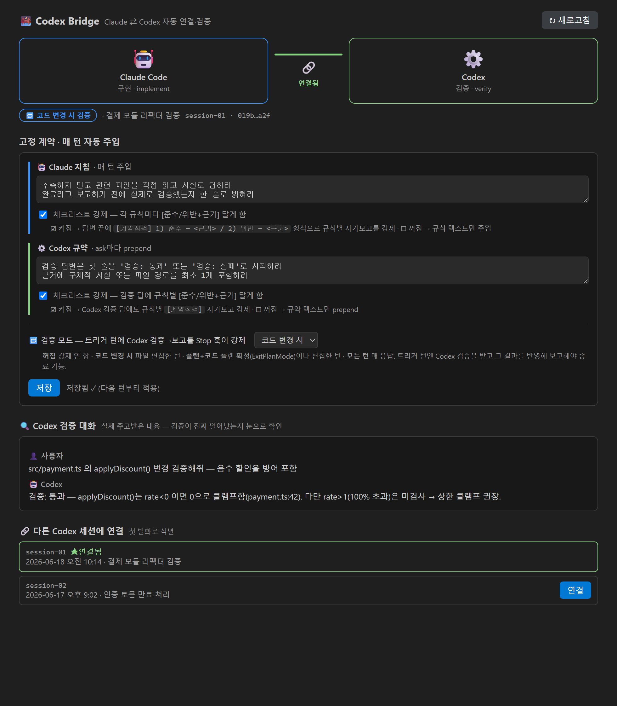
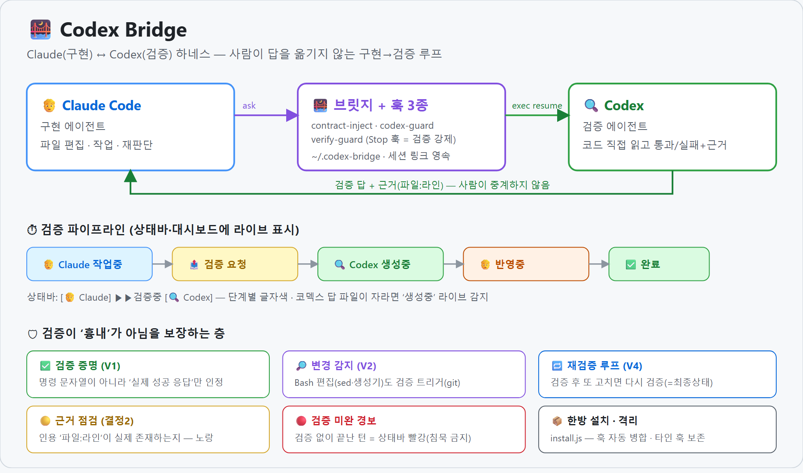

# Claude Code ↔ Codex Bridge

Claude Code ↔ Codex(OpenAI) 를 **하나의 작업 흐름으로 잇는** 도구 모음입니다. *(마켓플레이스용 영문 소개: [docs/README.en.md](docs/README.en.md))*
사람이 두 에이전트 사이에서 답을 복사·전달하지 않아도, **세션을 고정**하고 **고정 계약(규약)을 매 턴 주입**하며, 원하면 **구현→검증 2트랙**을 하니스가 강제합니다.

> **경로 표기**: 이 문서의 `~/.codex`·`~/.codex-bridge`·`~/.claude`는 모두 **기본값**입니다. `~/.codex`(코덱스 홈)는 `$CODEX_HOME` 또는 자동 탐지해 기억한 경로가 **없을 때만** 쓰는 기본값이고, `~/.codex-bridge`·`~/.claude`는 각각 `$CODEX_BRIDGE_HOME`·`$CLAUDE_CONFIG_DIR`이 없을 때의 기본값입니다. 정확한 경로·데이터 목록은 [PRIVACY.md](PRIVACY.md) 참고.

세 부분으로 구성됩니다.

| 구성 | 위치(런타임) | 역할 |
|---|---|---|
| **브릿지 엔진** | `~/.codex-bridge/codex-bridge.js` | Claude 세션 ↔ Codex 세션 연결을 영속 저장하고, 연결된 Codex 세션으로 `ask`(resume)·`link`·`status`·`find` |
| **훅(하니스 강제)** | `~/.codex-bridge/*.js` | `codex-guard`(raw codex 직접호출 차단) · `contract-inject`(계약 매 턴 주입) · `verify-guard`(검증 모드 시 종료 차단) |
| **VS Code 확장** | 이 저장소 루트 | 상태바·호버·대시보드로 연결 상태를 **보여주고**, 계약/체크박스를 **편집**하고, 연결을 **갈아끼움** |

확장 혼자로는 동작하지 않고 엔진(`bridge/`)과 훅이 함께 있어야 합니다 — **마켓플레이스로 설치하면 확장이 엔진을 자동 배치하고, 훅은 알림에서 동의 1클릭으로 등록**합니다(아래 "설치" 참고). 레포 한방 설치(`install.js`)도 그대로 지원됩니다.

## 미리보기



> 한 화면에 **Claude(구현) ⇄ Codex(검증)** 연결 · 검증 모드 · 프로젝트 규칙 · **검증 진행 라이브 스트립** · 코덱스 두뇌(모델·생각강도) · 실제 검증 대화가 모입니다.

### 구조 · 검증 흐름



> **Claude(구현) → 브릿지(훅 4종) → Codex(검증) → 근거 회신** (사람이 중계 안 함). 검증이 '흉내'가 아님을 보장하는 층(증명 V1 · Bash 변경 감지 V2 · 재검증 V4 · 근거 점검 결정2)과, 지금 검증이 어느 단계인지 **상태바·대시보드에 라이브 표시**합니다.

**상태바 — 검증 진행 라이브** (진행 중에만, 단계별 색):

```
[🧑 Claude]  ▶▶ 검증중 ▶▶  [🔍 Codex]      ← 코덱스에 묻는 중(코덱스 박스 초록)
[🧑 Claude]  ◀◀ 반영중 ◀◀  [🔍 Codex]      ← 검증 답 반영 중(클로드 박스 주황)
$(alert) Codex 검증 실패 1                    ← Codex 결론이 '검증 실패' = 빨강(고쳐 재검증 통과하면 자동 사라짐)
$(alert) Codex 검증 미완 1                    ← 검증 없이 끝난 턴 = 빨강(확인 전까지 지속)
$(warning) 두뇌 설정 어긋남 1                  ← 설정 모델/생각강도가 최근 실제 응답과 다름 = 노랑
$(warning) Codex 근거 의심 2                  ← 검증 답이 인용한 '파일:라인'이 존재하지 않음 = 노랑
```

*(상태바 배경 채움색은 VS Code가 빨강/노랑만 허용 → 단계 구분은 글자색 + 화살표로, 빨강은 검증 실패·미완 경보 전용.)*

---

## 기능

### 1. 세션 고정 (링크)
- 연결은 `~/.codex-bridge/links.json` 에 **Claude 세션 id + 워크스페이스** 두 키로 영속 저장 → 재접속·압축·리로드에도 유지.
- `ask`: 연결된 Codex 세션으로 `resume`. **연결이 없으면 보고만** 하고 새 세션을 임의로 만들지 않음. 첫 소통만 `--allow-new` 로 명시 생성.
- raw `codex exec/resume` 직접 호출은 `codex-guard`(PreToolUse 훅)가 차단 → 모든 Codex 접근이 브릿지를 통과.

### 2. 고정 계약 (매 턴 주입)

대시보드에서 **Claude 지침**과 **Codex 규약**을 입력합니다. **규칙은 한 줄에 하나씩**(Enter로 구분) — 글자수와 무관하게 *줄 단위*로 끊으며, 각 줄이 개별 규칙(번호 1, 2, 3…)이 됩니다.

> **프로젝트별 분리**: 계약(규칙·검증 모드 포함)은 **워크스페이스마다 따로** 저장됩니다(`~/.codex-bridge/contracts/<키>.json`). 여러 VS Code 창을 동시에 띄워도 **창마다 자기 프로젝트의 계약·연결만** 보고/적용합니다(대시보드·상태바는 그 창의 폴더를 따라감). **계약은 프로젝트 전용입니다 — 미설정 프로젝트는 빈 계약(주입 0)이며 전역으로 상속하지 않습니다.** 칸을 비우면 그 칸 규칙만 빠지고(최신성), 바꾸면 바뀐 값이 그 프로젝트에만 유지됩니다. (전역 기본값·상속·기본값 복원은 별개 층인 **단계별 기본 원칙**에만 있습니다 — §3.)

- **Claude**: `contract-inject`(UserPromptSubmit 훅)가 매 턴 컨텍스트에 주입.
- **Codex**: 브릿지가 매 `ask` 프롬프트 앞에 prepend.
- 칸이 비면 주입하지 않습니다(토큰 비용 0).

**체크리스트 강제 체크박스**(Claude·Codex 각각)는 그 규칙들을 *어떻게* 주입할지 정합니다.

- **해제** — 규칙 텍스트만 상수로 주입:
  ```
  [고정 규약 · Claude Code · 매 턴 적용되는 상수]
  {"rules":[{"n":1,"r":"추측 말고 파일을 직접 읽어라"},{"n":2,"r":"완료 전 검증했는지 밝혀라"}]}
  ```
- **체크** — 같은 규칙들이 *점검 항목*으로 펼쳐지고, AI가 매 답변에 각 항목의 준수 여부+근거를 달도록 강제:
  ```
  [계약점검]
  - 1) <준수|위반|해당없음> — <한 줄 근거>
  - 2) <준수|위반|해당없음> — <한 줄 근거>
  ```

> 주입은 규칙을 매 턴 눈앞에 둬 "잊어버림"을 막지만, AI의 실제 준수를 100% 보장하진 않습니다(형식적 체크 가능). **강제 명시**이지 강제 이행은 아닙니다.

### 3. 검증 모드 (구현→검증 2트랙, opt-in · 기본 OFF)

대시보드 **세그먼트 토글**로 **국면별 4모드** 중 선택합니다. ON인 모드에서, 트리거가 걸린 턴은 `verify-guard`(Stop 훅)가 Claude의 종료를 막고, Claude가 `codex-bridge ask`로 Codex 검증을 받아 그 결과(판정+근거)를 반영해 보고하도록 강제합니다(사람이 두 모델 사이를 중계하지 않음).

| 모드 | 검증을 강제하는 트리거 |
|---|---|
| **꺼짐(off)** | Codex 검증 왕복을 강제하지 않음(기본). ※*사용자 계약(Claude 행동규칙) 주입은 별개 축* — 계약이 설정돼 있으면 off여도 주입됨(주입 시점은 사용자 계약 카드의 꺼짐/플랜/항상 설정 따름). |
| **코드 변경 시(code)** | 파일 편집(`Write`/`Edit`/`MultiEdit`/`NotebookEdit`) **또는 git 저장소의 tracked/untracked 변경**(Bash 경유 생성·수정·삭제 포함; gitignored·비-git은 제외) 발생 턴 |
| **플랜 확정 + 코드 변경 시(plancode)** | `ExitPlanMode`(플랜 확정) **또는** 위 파일 변경 발생 턴 |
| **모든 턴(always)** | 모든 응답 |

- **트리거는 결정적 신호로 판정** — transcript의 `tool_use`(`ExitPlanMode`·편집 툴) **+ (git 저장소면) 실제 파일 변경**(바뀐 파일의 수정시각). 즉 `sed -i`·생성기·`rm` 같은 **Bash 경유 변경도 git 저장소에서는 잡습니다**(키워드 추측이 아니라 `git status`의 tracked/untracked 변경 기준). 단 **비-git 폴더·gitignored 파일·`git status` 실패/타임아웃**은 Bash 변경을 못 잡고 편집 툴 신호로만 폴백합니다. 별도 모델 추론이 없어 추가 토큰이 들지 않습니다.
- 이 검증 흐름의 핵심 지시문(아래 세 가지)은 **기본 지침(base directive)** — 사용자 고정 계약과 **별개로 하네스 최소 동작을 보장하는 고정 규약**입니다. 대시보드의 접힌 **🔒 기본 지침** 섹션에서 **보기/수정/기본값 복원**할 수 있습니다(코드에 캐논 기본값 상존, 수정분은 `~/.codex-bridge/base-directive.json` 오버라이드; 비우면 기본값).
- **검증 기본 원칙(→Codex, 항상 적용)**: 모든 `ask` 앞에 붙습니다 — *코드·파일을 실제로 열어 확인 / 생략·요약·축약 금지 / **요청자가 준 파일·범위는 시작점일 뿐 한계가 아님 — 요청자의 결론을 전제로 삼지 말고 호출부·테스트·문서까지 독립적으로 넓혀 반례를 찾으라** / 본문에 항목별 근거·보완·실패 사유를 먼저 쓰고, 판정 결론은 맨 마지막 한 줄에만(검증: 통과 / 통과(보완) / 보류 / 실패) — 근거를 먼저 보고 결론을 마지막에 둬 성급한 오라벨을 줄임(findings-first / verdict-last).* 엔진(`withContract`)이 강제하므로 Claude가 sloppy하게 요청해도 Codex 입력 단에서 방어됩니다.
- **전달 원칙(→Claude, 검증 요청 시)**: 요약/생략 없이 실제 파일 경로·확인 지점을 담되, **"여기만 봐라 / 이렇게 해라" 식 좁은 명령을 금지** — *내가 무엇을 했고·왜 했고·어떤 근거를 봤고·어디가 불안한지*를 주고 **내 결론은 "내 주장"으로 표시해 Codex가 공격하게** 합니다(파일·라인은 시작점, 검토 범위 확장은 Codex 판단에 맡김).
- **재판단(→Claude, 검증 답 받은 뒤)**: Codex 답을 그대로 옮기지 않고 **항목별로 수용/반박/보류 + 근거(파일·라인) + 사유**를 답니다. **수용 항목엔 반드시 근거**, 짧은 "동의/이견없음"으로 뭉개지 않습니다(반박·보류는 그 자체가 재판단 증거). 근거는 코드·파일에서 직접 확인 가능한 사실로. *(검증 절차 자체는 훅·proof·신선도·재검증으로 강제하지만, 모델 판단의 정확성과 재판단의 성실성까지 100% 보장하지는 않습니다 — 그래서 대시보드의 실제 검증 대화로 직접 확인하도록 둡니다.)*
- **검증으로 인정되려면 Codex가 ‘실제로 성공 응답’해야 합니다** — 명령만 친 것·빈 응답·미연결·이전 턴 검증은 인정 안 됩니다. 브릿지가 성공 시 **증명(proof)**을 남기고 `verify-guard`가 그 증명(이번 사용자 발화 + 마지막 변경 이후 + 응답 존재)을 봅니다. *(`echo … codex-bridge ask` 같은 흉내로는 통과 못 함.)*
- **재검증 루프**: 검증을 못 받으면 한 턴에 **여러 번 재요청**하고, 무한정지 방지를 위해 상한(기본 3회) 후엔 통과시키되 **그 사실을 무결성 경보로 남깁니다**(아래 §4 빨강). **검증 후 또 고치면 다시 검증**을 강제 → ‘검증받은 상태 = 최종 상태’.
- 구버전 `contract.json`의 `verify: true`는 자동으로 `code` 모드로 해석됩니다(하위호환).

### 4. 시각화 (확장) — 검증이 ‘지금 무엇을 하는지’ + ‘진짜인지’를 눈에
- **상태바(연결)**: 연결된 Codex 세션 주제 / 미연결.
- **상태바(검증 진행 라이브)**: 검증이 도는 동안 `[🧑 Claude] ▶▶검증중 [🔍 Codex]`로 단계가 흐릅니다(작업중→검증 요청→Codex 생성중→반영중→완료, 단계별 글자색·라운드 카운터). 브릿지가 동기로 막혀 있어도 **코덱스 rollout 파일이 최근 갱신된 것을 보고 ‘Codex 생성중’을 라이브 추정**합니다.
- **상태바(무결성 경보)**: **빨강 두 가지** — 검증이 필요했는데 **끝내 안 됐으면 ‘검증 미완’**(확인 전까지 지속·신규 시 잠깐 점멸), Codex 결론이 **‘검증 실패’면 ‘검증 실패’**(고쳐 재검증해 통과하면 자동 사라짐 — 미완 빨강이 확인으로만 사라지는 것과 구분). **노랑 세 가지** — Codex 결론이 **보류·불가·정보부족이면 ‘Codex 보류·불가’**, 검증 답의 **인용 근거가 실제 `파일:라인`과 불일치(없는 줄)거나 이 기록에서 다룬 흔적이 확인 안 되면 ‘근거 의심’**(모호한 인용은 거짓경보 방지로 건너뜀), 설정한 **모델/생각강도가 최근 실제 응답과 다르면 ‘두뇌 설정 어긋남’**(아래 §4 두뇌 drift). 빨강이 있어도 함께 뜬 노랑 건수를 같이 표기. 우선순위 = 빨강 > 노랑 > 진행. *(배경 채움색은 VS Code가 빨강/노랑만 허용 — 진행 단계는 글자색, 빨강/노랑은 경보 전용.)*
- **상태바·대시보드(두뇌 drift 경고)**: **의도한 모델·생각강도가 최근 실제 응답과 어긋나면** 노랑 ‘두뇌 설정 어긋남’으로 알립니다(고른 게 안 먹었거나 아직 반영 전일 때). **Codex**는 모델·생각강도 둘 다(연결 세션 rollout에 실제값이 기록됨) — 대시보드에서 고른 값이 **프로젝트별로 저장**되어 그 폴더의 실제 답과만 비교됩니다. **Claude Code**는 모델 계열만 봅니다 — Claude의 실제 생각강도는 대화기록 어디에도 남지 않아 비교할 수 없어 정직하게 탐지하지 않습니다(별칭 `opus`↔정식 `claude-opus-4-8`은 같은 계열로 처리). **Claude의 ‘의도한 모델’은 전역 설정 파일이 아니라 *그 프로젝트 대화 자신이 기록한 마지막 `/model` 선택*에서 읽습니다** — Claude Code의 `/model`은 전역 `settings.json` 한 파일에 저장되므로, 프로젝트 2개를 서로 다른 모델로 동시에 쓰면 한쪽의 `/model`이 다른 쪽 ‘설정값’을 바꿔 거짓 경고가 나는 구조였습니다(v0.1.77에서 수정). 대화에 `/model` 기록이 없으면 **대화 시작 전에 정해져 있던 설정**만 기본값으로 인정하고, 대화 도중 바뀐 전역 설정(다른 창의 `/model`일 수 있음)은 비교하지 않습니다 — *과소경고는 허용, 거짓경고는 불허*. **패널 UI의 모델 피커(Switch model)** 전환은 대화기록에 흔적을 남기지 않지만, **그 순간 포커스(활성)였던 창**이 곧 조작한 창이므로 그 프로젝트의 선택으로 귀속해(`cc-intent.json`) 몇 초 내 즉시 경고에 반영합니다 — 다른(비포커스) 창들엔 영향을 주지 않습니다. 참고로 Claude Code는 모델 설정이 전역 1개라 **다른 창에서 바꾼 값이 이 창의 '새 턴'부터 조용히 적용될 수 있는데**, 이 창의 의도는 따로 기억되므로 그 침묵 전환도 답이 오는 순간 경고로 잡힙니다. (한계: transcript 첫 스캔은 꼬리 16MB만 백필해 그보다 앞의 `/model`은 새 선택 전까지 못 볼 수 있고, 변경 순간 VS Code가 모두 비포커스였던 변경(외부 편집 등)은 귀속 없이 보수적으로 비교를 쉽니다. 또 이 귀속 기록이 도입되기 **전**에 UI 피커로 바꾼 이력은 한 번 애매할 수 있습니다 — 그 뒤부터는 정확히 따라갑니다. 어느 경우든 잘못 뜨는 쪽보다 안 뜨는 쪽으로 기웁니다.) 이 확장은 설정 파일을 **읽기만** 하며 당신의 모델/생각강도를 바꾸지 않습니다. 어긋남 원천(Claude 대화기록·`settings.json`, Codex 연결 rollout)이 바뀌면 즉시/주기적으로 다시 읽어 반영하고, 확인(ack)하면 사라집니다. 비교 대상은 **대시보드가 기준 삼는 폴더**(보통 연 폴더)의 **같은 대화**에서 나온 의도·실제값으로 한정하고(공유 세션·전역 기록에서 다른 폴더의 답/선택이 새지 않게 — 코덱스 답은 rollout에 기록된 *실행 폴더*가 그 기준 폴더와 일치하는 turn만 봅니다. 따라서 코덱스가 **외부 작업 폴더**에서 돌면 일치하는 turn이 없어 경고가 억제될 수 있습니다), **신선도 창(7일)** 밖의 오래된 기록은 제외합니다(여러 프로젝트 병행 개발에서 3일+ 텀이 흔하다는 실사용 기준 — 몇 주 전 옛 기록은 여전히 차단).
- **정찰(3트랙) 용어 한눈에** — 대시보드의 정찰 구역은 하나의 흐름입니다(각 단계에 LLM 사용 여부 배지):
  | 단계 | 무엇 | LLM | 비용 |
  |---|---|---|---|
  | ① 변경 감지 | 지금 바뀌는 파일 + 과거에 함께 바뀐 통계(옛 표기 '범위 장부') | ⚙ 없음 | 0 |
  | ② 영향지도 | 이 변경이 어디까지 번질지 정찰 AI가 미리보기(옛 표기 '영향지도 게시판') | ⚡ 호출 | self 팔=별도 과금 없음(쓰던 Claude 사용량 범위) / DeepSeek 키 |
  | ③ 관찰 일지 | 검증을 지나며 맞은 것·틀린 것이 자동 축적(옛 표기 '관측 장부'·'MAP 장부') | ⚙ 추가 호출 없음 | 0 (검증 대화에 편승) |
  | ④ 확정 교범 | 원할 때만 도장 찍어 저장소 문서(docs/MAP.md)로 — 안 써도 ①~③은 그대로 자동 | 👤 선택 | — |

  적재·승격·강등은 전부 자동이고, 수동 장치(고정/차단/내보내기)는 선택적 덮어쓰기·승격 전용입니다. 상태바 호버에는 "지금 실행 중인 LLM 호출" 여부가 상시 표시됩니다.
- **호버**: 세션 id·주제·연결시각·마지막 활동.
- **대시보드**(클릭): 연결 상태(Claude⇄Codex 모노그램·연결 라인), **검증 진행 스트립**([Claude]⟷[Codex] 방향·활성 박스), **무결성 배너**(빨강=검증 미완·Codex 검증 실패 / 노랑=Codex 보류·불가[정보부족 등]·근거 의심[불일치·미확인]·두뇌 설정 어긋남, 각 줄은 빨강/노랑 점으로 분리, ‘확인함’으로 해제), **검증 대화**(사용자 말풍선 + Codex 카드·판정 4색 칩[통과 / 통과(보완) / 보류 / 실패]·긴 글 "펼치기"), 후보 세션 목록(첫 발화로 식별)+`[연결]`·숨김/복원, 고정 계약 편집칸+체크박스, **검증 모드 세그먼트 토글**, **코덱스 두뇌 설정**(모델·생각강도 *선택*, 계정 캐시 기반 — Claude 쪽은 카드 없이 위 두뇌 drift 경고만), **검증 대기시간**(기본 8분·1~60분, 전역), **트랙 세그먼트**(2트랙=구현↔검증 기본 / 3트랙=+정찰 — 위 '정찰(3트랙) 용어 한눈에'의 4단계 흐름[①변경 감지 ②영향지도 ③관찰 일지 ④확정 교범]이 대시보드에 켜집니다. 프로젝트별 저장 · 관찰(advisory) 단계라 아무것도 막거나 강제하지 않음 · 외부 전송은 DeepSeek 키 등록 시 둘뿐 — ②의 팔 실행 시 꾸러미 + 3트랙 켤 때 연결 점검 1회(키 등록=동의, [PRIVACY.md](PRIVACY.md)). **전제: ①의 함께-변경 통계는 로컬 git '커밋 이력'을 읽습니다 — git 저장소가 아니거나 커밋이 거의 없으면 통계만 "데이터 없음"이 정상이고, ② 지도는 '무이력 모드'(최근 수정 파일 기준)로 여전히 만들 수 있습니다**), 접힌 **단계별 기본 원칙** 보기/수정/기본값 복원. 섹션마다 색 막대·구분선으로 경계 구분(장식 이모지 없음). `links.json`·코덱스 세션·Claude 설정/대화기록·진행/무결성 변경 자동 감지(여러 VS Code 창은 워크스페이스로 격리).
- 대시보드·상태바는 **지금 Claude가 실제 도는 폴더**(훅이 `~/.codex-bridge/active.json`에 기록)를 따라가므로 **보여주는 세션 = 검증이 실제 가는 세션**이 일치합니다(열린 폴더가 여러 개여도 어긋나지 않음). 어느 폴더 기준인지는 📁 칩으로 표시됩니다.
- **언어(한국어/English)**: 대시보드 탭바 우측 토글로 전환합니다. **전역 설정 하나**(`~/.codex-bridge/language.json`)라 모든 프로젝트·창에 함께 적용되고, 첫 실행 시 VS Code UI 언어를 따라 초기화됩니다. 전환 시 **UI 문자열 + 주입 지침(기본 지침·검증 directive·훅 차단문) + 판정 형식**이 함께 바뀌며, 판독기는 언어 설정과 무관하게 한/영 판정 줄(`검증: 통과` / `Verdict: pass`)을 항상 둘 다 인식합니다. **프로젝트 규칙·기본지침 오버라이드는 언어별 슬롯**에 따로 저장됩니다 — 한국어 슬롯은 기존 파일 그대로(무손실), 영어는 별도 파일(`<키>.en.json`·`base-directive.en.json`). 언어를 바꿨을 때 그 언어 칸이 비어 있으면 "다른 슬롯에 규칙이 있다"는 안내가 떠서 사라진 것으로 오해하지 않게 합니다.
- **검증 통계 탭** (대시보드 상단 `[현황]` / `[검증 통계]` 토글): 이 폴더의 검증 활동을 한 화면에 — 최근 7일 **검증 횟수·완전통과율·보완이상 비율·전환(실패·보류 뒤 통과)**, 28일 **verdict 분포**(도넛 + 색별 가로막대, ‘판정표지 누락’=Codex가 통과/실패 결론 줄을 안 적은 답은 통과율 분모서 제외), 14일 **추이**(완전통과/통과보완/보류/실패/표지누락 5색 스택), 4주 **활동 히트맵**(요일×시간), **토큰**(연결 코덱스 세션 누적 · 이 폴더 클로드 작업 토큰+턴수 · 모델·추론강도별 · 검증모드별), **프로젝트별 비교**(이건 전체 폴더 28일 group-by — ‘이 폴더’ 통계와 별개 섹션). ‘이 폴더’ 통계는 모두 **연 폴더 기준**(작업 cwd가 흔들려도 일관)·**메타만 기록**(프롬프트/답 원문 미저장)·로컬 집계. 모델·1회 토큰은 rollout 마지막 턴 기준 *근사*로 정직하게 표기합니다.

### 5. Codex 실행 파일 탐색 + 진단(doctor)
브릿지는 codex 바이너리를 **경로로 뒤지지 않고** 다음 순서로 해석합니다(설치 형태·잦은 버전 업데이트에 안 깨짐):
1. 환경변수 `CODEX_BIN` (직접 지정)
2. VS Code 설정 `codexBridge.codexPath` — 비우면 **설치된 Codex 확장(`openai.chatgpt` 등) 내부의 codex를 확장이 vscode API로 자동 탐색**해 기록(포터블/설치형·버전 무관, 활성화마다 갱신)
3. `PATH` 의 `codex` (CLI 설치 표준; Windows `.cmd`는 셸 경유, 프롬프트는 stdin이라 따옴표 안전)

진단: `node ~/.codex-bridge/codex-bridge.js doctor` → 지금 **어떤 codex를 어디서 쓰는지·실행 가능 여부·연결 상태·브릿지 폴더 일치**를 한 번에 표시(막혔을 때 추측 대신 이것부터). (홈 경로에 공백이 있으면 경로를 따옴표로 — `node "$HOME/.codex-bridge/codex-bridge.js" doctor`. 아래 CLI 섹션 노트 참조.)

---

## 설치

### 마켓플레이스 설치 (확장 → 알림 1클릭)
VS Code 마켓플레이스(또는 vsix)로 확장을 설치하면:
1. 확장이 브릿지 엔진을 **자체 폴더**(브릿지 홈, 기본 `~/.codex-bridge`)에 자동 배치합니다 — 다른 앱 설정은 건드리지 않습니다. (배치 표식 `.bridge-deployed-by.json`으로 확장 버전 업그레이드 시에만 갱신)
2. 검증 훅이 등록돼 있지 않으면 알림이 뜹니다 — **[설치 내용 보기]** → *바꾸는 파일·백업 위치·등록될 훅 4줄*을 확인하고 **[설치]** 1클릭. Claude Code 설정(`settings.json`)은 **이 동의 후에만** 병합됩니다(수정 전 `settings.json.bak.<시각>` 백업, 기존 다른 훅 보존 — 레포 설치기와 같은 규칙).
3. Claude Code **새 세션부터** 검증이 동작합니다. (알림을 닫았어도 명령 팔레트 `Codex Bridge: Claude Code 검증 훅 설치`로 언제든 다시 실행)
4. **제거도 확장에서**: 확장을 제거하면(다음 VS Code 재시작 시점에) **확장이 설치했던 훅·엔진만 자동 정리**됩니다 — 훅은 백업을 남기고 빠지고, 다른 훅·연결/통계 데이터는 보존됩니다(완전 삭제는 브릿지 홈 폴더 삭제). 레포 설치분은 건드리지 않습니다(`node install.js uninstall`이 담당).

> 이미 레포 한방 설치(`install.js`)를 쓴 경우: 확장은 **수동 설치를 존중해 브릿지를 덮지 않습니다**(레포 설치가 계속 정본). 브릿지 파일이 일부만 깨졌으면 누락분만 채웁니다.

### 한방 설치 (권장)
레포 루트에서 한 줄이면 됩니다. 브릿지 엔진 복사 + `~/.claude/settings.json` 훅 자동 병합(기존 훅 보존) + 백업 + **확장 설치(설치 시 항상 현재 소스로 빌드 → 캐시된 옛 VSIX로 stale 설치되는 일 방지)**까지 한 번에.

```bash
npm install
node install.js            # 또는: sh install.sh   /   Windows: install.cmd 더블클릭
```

- 여러 번 돌려도 안전(멱등). 옛 형태로 등록돼 있던 우리 훅은 새 형태로 업그레이드되고, **memento 등 다른 훅은 그대로 보존**됩니다.
- 설정을 고치기 전 항상 타임스탬프 백업(`settings.json.bak.<시각>`)을 남깁니다. 설정이 올바른 JSON이 아니면 **건드리지 않고 중단**합니다.
- 훅이 쓸 `node` 경로는 셸에서 실제 실행되는지 확인해 **절대경로로 고정**합니다(공백 있는 경로·`PATH`에 node 없는 환경 대응).
- **확장 설치는 `PATH`에 `code`가 없어도 됩니다** — 지금 실행 중인 VS Code(포터블/무설치형 포함)와 OS 표준 설치 위치를 자동탐지합니다(여러 VS Code가 있으면 *지금 띄운* 그 VS Code 우선). 아주 비표준 환경(예: code-server·비표준 Flatpak·특이 포터블 경로)이라 못 찾으면 `CODE_CLI`에 `code`(Windows는 `code.cmd`) 실행파일 경로를 지정하세요. `--dry-run`이 어떤 `code`를 쓸지 미리 보여줍니다.
- 미리보기: `node install.js --dry-run` (아무것도 쓰지 않고 무엇을 바꿀지 보여줌).
- 제거: `node install.js uninstall` (우리 훅만 제거, 백업 보존) / 완전삭제 `node install.js uninstall --purge`.
- 낯선 환경 조정 환경변수: `CODEX_BRIDGE_HOME`(브릿지 폴더) · `CLAUDE_CONFIG_DIR`(Claude 설정 폴더) · `CODEX_BRIDGE_NODE`(훅용 node 절대경로) · `CODE_CLI`(VS Code `code` 경로).
- 설치 후 VS Code에서 `Developer: Reload Window`.

> 설치기는 외부 파일인 `~/.claude/settings.json` 을 바꿉니다. 무엇이 바뀌는지 먼저 보려면 `--dry-run` 을 권합니다.

아래는 수동으로 단계별로 설치하려는 경우의 절차입니다(한방 설치를 썼다면 건너뜁니다).

### 1) 브릿지 엔진·훅 배치 (수동)
`bridge/` 의 `.js` 파일들을 홈의 `~/.codex-bridge/` 로 복사합니다.

```bash
mkdir -p ~/.codex-bridge
cp bridge/*.js ~/.codex-bridge/
```

계약은 **대시보드에서 프로젝트별로** 작성합니다 — 저장하면 그 프로젝트 파일(`~/.codex-bridge/contracts/<키>.json`)에만 기록되고 **다른 프로젝트로 상속되지 않습니다**(미설정 프로젝트는 빈 계약). (`contract.json`은 폴더 없는 창의 저장 폴백·구버전 호환용 레거시일 뿐 상속 시드가 아닙니다. `contract.example.json`은 계약 구조 예시.)

### 2) 훅 등록 (수동)
`settings.example.json` 의 `hooks` 블록을 Claude Code `~/.claude/settings.json` 에 병합합니다.
`<HOME>` 을 실제 홈 경로(예: `C:/Users/이름`)로 바꾸고, 기존 다른 훅은 보존하세요.

> **글로벌(`~/.claude/settings.json`)에 넣어도 안전합니다 — 프로젝트별로 반복 설정할 필요 없음.** 훅은 항상 등록돼 있되, 실제 동작·비용은 **전적으로 확장 대시보드(고정 계약 / 검증 모드)가 제어**하기 때문입니다:
> - `codex-guard` — 직접 `codex` 호출 가드. **모델 토큰 0**(통과/차단만).
> - `verify-guard` — 검증 모드가 **꺼짐이면 즉시 no-op**. 켰을 때만, 고른 트리거에서 동작.
> - `contract-inject` — **대시보드 계약 칸에 적은 줄만** 주입. 칸을 비우면 주입 0.
>
> 즉 기본/비활성 상태에서는 글로벌이어도 사실상 무비용이고, 무엇을 켤지는 `settings.json` 을 건드리지 않고 대시보드에서 토글합니다. (에이전트로 설치를 자동화할 때 "글로벌 훅이 매 턴 비용 아니냐"는 우려가 불필요한 이유)

### 3) 확장 설치 (수동)
```bash
npm install
npm run package
code --install-extension codex-bridge-*.vsix --force
```
설치 후 `Developer: Reload Window`.

> Codex 실행 파일은 OpenAI ChatGPT VS Code 확장(`openai.chatgpt-*`)의 `codex` 바이너리를 자동 탐색합니다. 필요 시 `CODEX_BIN` 환경변수로 지정하세요.

---

## CLI (브릿지 엔진 직접 사용 · 선택)

`~/.codex-bridge/codex-bridge.js` 는 Codex와 실제로 대화하는 **엔진**입니다. 평소엔 **확장·훅이 자동으로 호출**하므로 직접 칠 필요가 없고, 아래는 **수동 연결·상태 확인·문제 진단**용입니다.

> 💡 **홈 경로에 공백이 있으면**(예: `C:/Users/First Last`) 경로를 따옴표로 감싸세요 — `node "$HOME/.codex-bridge/codex-bridge.js" doctor`. `node`가 PATH에 없으면 node를 절대경로로(예: `"C:/Program Files/nodejs/node.exe"`). `CODEX_BRIDGE_HOME`을 설정하면 `.codex-bridge` 위치를 옮길 수 있습니다(그땐 훅 명령 경로도 그에 맞추세요).

```bash
node ~/.codex-bridge/codex-bridge.js ask "<프롬프트>"        # 연결 세션에 보내고 답 받기(없으면 보고)
node ~/.codex-bridge/codex-bridge.js ask --allow-new "<...>" # 첫 소통: 새 세션 생성+연결
node ~/.codex-bridge/codex-bridge.js ask --net "<...>"       # 이 1회만 검증자 네트워크 허용(원격 확인용 — 아래 안전 원칙 참조)
node ~/.codex-bridge/codex-bridge.js link <codex-session-id> # 기존 Codex 세션에 연결
node ~/.codex-bridge/codex-bridge.js link --last             # 가장 최근 세션에 연결
node ~/.codex-bridge/codex-bridge.js status | find           # 상태 / 후보 목록
node ~/.codex-bridge/codex-bridge.js doctor                  # 지금 어떤 codex를 쓰는지·실행 가능 여부·연결 상태 진단
```

---

## 배포 (관리자용)

한 명령이 **버전 올림 → 전체 테스트 → vsix 빌드(+이 PC 설치) → 깃헙 push → 마켓 게시/안내**까지 처리합니다(조수·기억·PC와 무관하게 저장소에 박힌 절차):

```bash
npm run release              # patch 버전 올림(0.1.74→0.1.75) 후 전 과정
npm run release -- --minor   # 0.2.0 식으로 올림 (--major, --version 1.2.3 도 가능)
```

- 커밋 안 된 변경이 있으면 **시작 전 중단**(무엇이 배포되는지 명확하게). **커밋 전 실패**는 버전 파일을 원복하고, **push/마켓 게시 실패**는 "어디까지 반영됐고 다음 명령이 뭔지"를 정확히 안내합니다(게시만 재시도: `npm run release -- --publish-only`, 버전이 또 올라가지 않음).
- 마켓 게시: 환경변수 `VSCE_PAT`(마켓 publish 권한 토큰)가 있으면 자동 — 단 **push까지 된 완전 배포일 때만**(`--no-push`면 마켓 게시도 건너뜀 — 마켓만 앞서가는 반쪽 배포 방지). 없으면 업로드할 vsix 경로를 안내(관리 페이지 ⋮ → Update에 드래그 1회). 마켓은 같은 버전 재업로드를 거부하므로 버전은 스크립트가 매번 올립니다.

## 읽기 전용·안전 원칙
- 대화 내용(코덱스 홈, 기본 `~/.codex` 아래 `sessions`)은 평소엔 **읽기만** 합니다. **단 하나의 예외**: 대시보드에서 숨긴 세션을 **‘영구삭제’로 명시 확인**(확인 모달·공유 세션 경고)하면 그 Codex rollout 파일을 삭제합니다(사용자가 직접 누른 경우만). 그 외에는 원본 rollout을 옮기거나 지우지 않습니다.
- **일반 런타임 상태**는 모두 자체 폴더(브릿지 홈, 기본 `~/.codex-bridge`)에 씁니다: `links.json`(연결)·계약(`contracts/<키>.json` 프로젝트별 · `contract.json`은 레거시 전역 폴백·상속 안 함)·`active.json`(현재 폴더)·`proofs/`(검증 증명)·`integrity.json`(무결성 경보)·`phase.json`(진행 단계)·`base-directive.json`(기본 지침 오버라이드)·`cc-intent.json`(프로젝트별 Claude 모델 선택 귀속 — 모델명·시각만, 30일 자동정리)·`stats/verdicts.jsonl`(검증 통계 메타 — 프롬프트/답 원문 미저장·60일 자동정리). 모두 런타임 데이터라 저장소에 포함되지 않습니다. (경로는 `$CODEX_HOME`·`$CODEX_BRIDGE_HOME`로 바뀔 수 있음 — [PRIVACY.md](PRIVACY.md) 참고.)
- **외부 전송은 기본적으로 없음**: codex 호출은 사용자의 codex CLI를 로컬에서 실행할 뿐, 별도 서버로 데이터를 보내지 않습니다. **예외는 둘뿐**(DeepSeek 키 등록 시): ① 탐색(3트랙)의 DeepSeek 지도 생성이 **실행될 때** 자료 꾸러미 — 직접 실행하거나, 3트랙 자동 지시를 받은 Claude가 실행(키 등록=동의 · 확장·훅 자체는 꾸러미를 전송하지 않음) ② 3트랙을 켤 때 **연결 점검 요청 1회**(꾸러미 아님). 무엇을 보내고 무엇을 자동 제외하는지는 [PRIVACY.md](PRIVACY.md)에 명시돼 있습니다.
- **검증자(Codex)는 기본적으로 통신 차단**: 검증 실행은 Codex의 읽기 전용 샌드박스에서 돌아 외부 네트워크가 막혀 있습니다(원격 사실은 구현모델이 조회해 검증 요청에 첨부하는 게 기본). `ask --net`을 명시하면 **그 1회에 한해** 네트워크를 허용하되 파일은 여전히 읽기 전용입니다 — 단 이때 도메인 제한은 걸리지 않으므로(Windows 실측: allowlist 미집행) "원격 저장소 상태를 직접 확인할 필요가 있는 검증"에만 쓰세요. 전역 설정(config.toml)은 건드리지 않습니다.
- 검증 모드는 opt-in이며 Stop 훅 강제는 한 턴에 상한(기본 3회)까지만 반복하고 그 뒤 통과시켜(+무결성 경보 기록) 작업이 멈추는 사고를 내지 않습니다.

### 자세한 정책 문서
- [SECURITY.md](SECURITY.md) — 보안 경계인 것 / 아닌 것, 설치기가 바꾸는 것, 신고 방법
- [PRIVACY.md](PRIVACY.md) — 정확히 어떤 파일을 읽고 쓰는지, 외부 전송(기본 없음·예외 둘 명시: 지도 생성 꾸러미+연결 점검 1회), 데이터 삭제
- [COMPATIBILITY.md](COMPATIBILITY.md) — 지원 OS·Node·VS Code 범위, 코덱스 업데이트로 깨질 수 있는 지점, 진단

---

## 커버 범위 vs 한계 (정직하게)

이 도구가 **무엇을 보장하고, 무엇은 보장하지 않는지**를 한곳에 모았습니다. 과장 없이 읽고 쓰세요.

### 확실히 하는 것
- **연결 영속·자동 재개**: 연결(`links.json`)은 재접속·압축·리로드에도 유지되고, `ask`는 연결 세션으로 자동 resume합니다.
- **검증 *절차*의 기계적 강제**: 검증 모드 ON에서 트리거가 걸린 턴은 "Codex가 실제로 성공 응답한 증명(proof)"이 없으면 종료가 막힙니다. 증명은 **이번 사용자 발화 이후 + 마지막 파일/플랜 변경 이후 + 비어있지 않은 응답**을 요구하므로, `echo`·실패·미연결·이전 턴 검증·검증 후 재수정으로는 통과하지 못합니다.
- **결정적 트리거**: 코드 변경 감지는 키워드 추측이 아니라 transcript의 편집 `tool_use` + (git 저장소면) `git status`의 실제 변경시각 기준이라 추가 토큰이 들지 않습니다. 단 git 변경 감지는 **git 저장소의 tracked/untracked 변경에 한정** — 비-git 폴더·gitignored 파일·`git status` 실패는 Bash 경유 변경을 못 잡고 편집 툴 신호로만 폴백합니다(완전한 변경 감지를 보장하지는 않음).
- **외부 전송 기본 없음 / 읽기 전용 원칙**: 기본 동작의 모든 데이터는 로컬에 머물고(예외 둘: DeepSeek 지도 생성 실행 시 자료 꾸러미 + 3트랙 켤 때 연결 점검 1회 — [PRIVACY.md](PRIVACY.md)에 전송·제외·조건 명시), 코덱스 원본 기록은 *직접 "영구삭제"를 누른 한 파일* 외엔 건드리지 않습니다.
- **창 격리**: 여러 VS Code 창은 작업 폴더 경로로 격리되어 서로의 연결·계약·경보가 섞이지 않습니다.

### 보장하지 *않는* 것 (설계상 한계)
- **모델 판단의 정확성**: 검증 *절차*는 강제하지만 Codex의 판정이 옳다는 보장도, 재판단의 성실성 보장도 없습니다. 그래서 대시보드에 **실제 검증 대화를 그대로** 보여줘 직접 확인하게 둡니다.
- **계약·검증의 100% 이행**: 규칙을 매 턴 눈앞에 두지만 모델이 형식적으로만 따를 수 있습니다. **강제 명시**이지 강제 이행은 아닙니다.
- **Claude 생각강도(effort) 탐지**: Claude의 실제 런타임 생각강도는 대화기록 어디에도 남지 않아 비교가 불가능 → **Claude는 모델 계열만** 봅니다(Codex는 rollout에 실제값이 있어 모델·생각강도 둘 다). 정직하게, 못 하는 건 안 합니다.
- **두뇌 drift 신선도 창(7일)**: 오래된 기록이 거짓 경고를 내지 않게 **신선도 창 밖의 옛 답/세션은 비교에서 제외**합니다. 창은 7일 — 여러 프로젝트를 병행하면 한 프로젝트에 3일+ 텀이 흔해서, 예전의 24시간 창은 하루만 쉬어도 모든 즉시 경고를 침묵시키는 과잉 억제였습니다(v0.1.80에서 확장, 몇 주 전 옛 기록은 여전히 차단). 그 대가로, *일주일 넘게* 쉬었다가 재개하면 **첫 새 응답이 나오기 전까지는 drift 경고가 조용히 억제**됩니다(의도된 trade-off: 거짓 경고보다 침묵). 새 답이 한 번 나오면 정상 비교로 돌아옵니다.
- **폴더당 Codex 세션 1개**: 한 작업 폴더는 한 번에 **하나의 Codex 세션**에만 연결됩니다. 다시 연결하면 **마지막 연결이 이깁니다**(여러 세션 동시 연결 아님).
- **멀티루트/같은 폴더 다중 창의 잔여**: 확장의 "지금 도는 폴더" 표시는 훅이 쓰는 `active.json`을 따릅니다. **같은 폴더**를 여러 창에서 동시에 굴리면 마지막으로 제출한 창이 이 값을 덮어, 드물게 다른 창 기준으로 표시/비교할 수 있습니다(세션별 `active/<세션>.json` + 폴더·신선도 가드로 대부분 막히지만 완전 격리는 범위 밖).
- **경로 별칭**: 심볼릭 링크·`subst` 드라이브·원격/컨테이너 경로로 같은 폴더가 다른 경로처럼 보이면 격리·표시가 어긋날 수 있습니다(실제 경로로 열면 정상). [COMPATIBILITY.md](COMPATIBILITY.md) 참고.
- **PC 간 규칙 동기화 없음**: 프로젝트 규칙은 작업 폴더 *절대경로*로 식별 → 다른 PC·다른 경로면 다른 규칙 파일을 봅니다.
- **검증 근거 점검(노랑)은 참고용 의심**: 인용한 `파일:줄`이 실제와 맞는지/세션에서 다뤘는지를 보수적으로 표시할 뿐, 글롭·파이프·출력 잘림에선 거짓 노랑이 날 수 있습니다(판정이 아님).
- **무한정지 방지 상한**: 검증을 못 받으면 한 턴에 최대 3회 재요청 후 **통과시키되 무결성 경보(빨강)로 남깁니다** — 작업이 멈추는 사고를 막기 위한 trade-off.
- **코덱스 내부 형식 의존**: 코덱스 업데이트로 rollout 형식·`doctor` 출력·실행 명령이 바뀌면 깨질 수 있습니다(그때는 `doctor`로 진단). [COMPATIBILITY.md](COMPATIBILITY.md) 참고.
- **설치 반영**: 확장을 새로 설치/업데이트하면 **실행 중인 창은 `Developer: Reload Window`** 해야 적용됩니다.

## 라이선스
MIT — `LICENSE` 참조.
